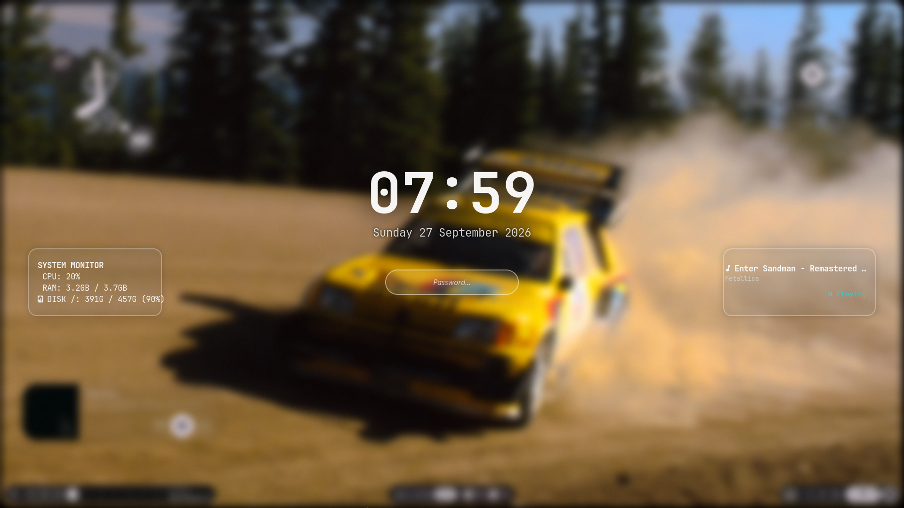

# Liquid Glass Hyprlock

A sleek and modern **Liquid Glass** themed configuration for `hyprlock`, designed specifically for Hyprland on Arch Linux.

<p align="center">
  
</p>

---

## 🌟 Features

- **Glassmorphism Design**: Minimalist and polished blurred aesthetics for your lock screen.
- **Media Controls Support**: Integrates seamlessly with `playerctl` to display current media playback status.
- **Automated Setup**: Python-based installation script handling dependency checks and file deployment.
- **Idle Support**: Works out of the box with `hypridle`.

---

## 📋 Requirements

Before installing, ensure you have the following packages available on your system (the installer will attempt to install missing dependencies automatically via `pacman`):

- **[Hyprland](https://hyprland.org/)**
- **hyprlock**
- **hypridle**
- **playerctl**
- **Python 3**

---

## 🚀 Installation

To install the theme, run the following commands in your terminal:

```bash
cd /tmp
git clone https://github.com/axy0n-qli/liquid-glass-hyprlock-confg.git
cd liquid-glass-hyprlock-confg
chmod +x install.sh
./install.sh
```

## 🔄 Updating
To update the configuration to the latest release, run:
```bash
./update.sh
```
## 📄 License

This project is open-source and released under the **GNU General Public License v3.0 (GPLv3)**. Feel free to modify and distribute it under the terms of the GPLv3 license. See the [LICENSE](LICENSE) file for more details.
